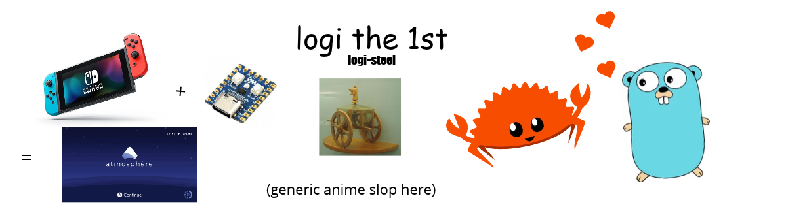

software (maybe working) engineer, building high-performance bugs, vibe coding in english, 
and
developer infrastructure.

- languages: python · rust · lua
- tools: Git · Docker · Linux · Apple Silicon 

  

## my core skills  ##
- programming really good in team
- modding the hell out of what i have
- trying to learn new things but losing motivation
- big knowledge about 3d printing
- ceo of nothing (not the phone makers)

